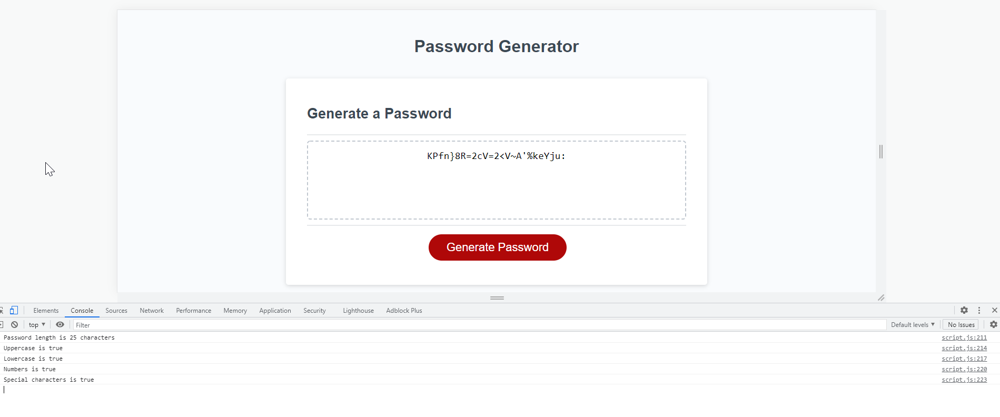

# passkey_generator
This page has javascript that enables the user to generate random passwords based on criteria that they’ve selected. 
The user clicks the red button to generate a password
The user is presented with a series of prompts for password criteria
First, the user is asked for the length of the password
Then, they choose a length of at least 8 characters and no more than 128 characters
Next, the user is asked for character types to include in the password
Then, the user confirms whether or not to include lowercase, uppercase, numeric, and/or special characters
If the user does not confirm any of the above, the password will be generated with all of the character types.
When all prompts are answered, a password is generated that matches the selected criteria and the password is either displayed.

